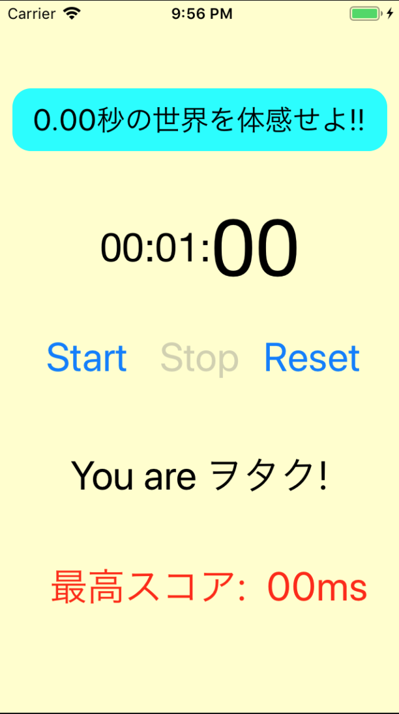

## Stop Watch

*ストップウォッチ 兼 0.00秒で止めると気持ち良いアプリ*

1. 概要

    - ストップウォッチ機能(カップ麺用)
    - 0.00秒の停止に挑戦する暇つぶし機能付き

1. 環境

    - Xcode 10.1
    - Swift 4.2.1
    - Man-hour 2.0h

1. 学び / ポイント

    - タイマーの使い方 / Timer.scheduledTimer

1. イメージ

    |                          Screen1                           |
    |------------------------------------------------------------|
    |  |

1. ソースコード

    [GitHub](https://github.com/nsuhara/swift-StopWatch.git)
